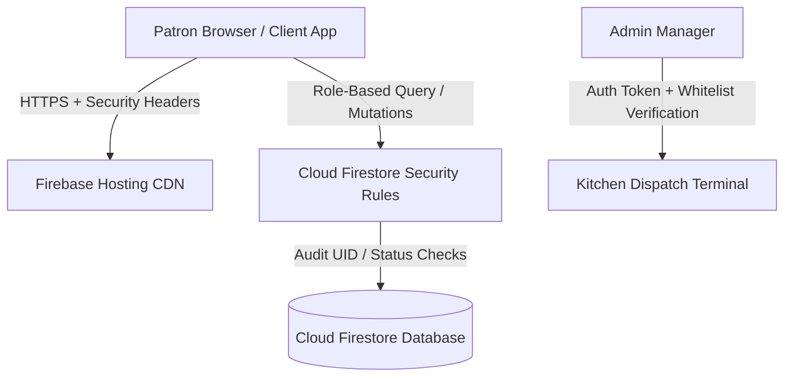

# 🌿 Spice Tree • Pure Vegetarian Restaurant & Cloud Kitchen

<div align="center">

[](https://spicetree-restaurant.web.app)
[](https://react.dev/)
[](https://www.typescriptlang.org/)
[](https://vitejs.dev/)
[](https://firebase.google.com/)
[](https://tailwindcss.com/)
[](https://spicetree-restaurant.web.app/menu)

<p align="center">
  <strong>A modern, enterprise-grade online ordering, real-time kitchen tracking, and restaurant dispatch platform for Spice Tree (G.T. Road, Phagwara, Punjab).</strong>
</p>

[Explore Live Web App](https://spicetree-restaurant.web.app) • [View Menu](https://spicetree-restaurant.web.app/menu) • [Track Orders](https://spicetree-restaurant.web.app/orders) • [Reserve Table](https://spicetree-restaurant.web.app/reserve)

</div>

---

## 🌟 Executive Overview

**Spice Tree** is a state-of-the-art food commerce and restaurant management web application engineered for high-throughput ordering, live kitchen dispatch, customer engagement, and airtight cloud security. Built with **React 19**, **TypeScript**, **Tailwind CSS**, and **Firebase Cloud Firestore**, the platform serves both customer-facing patrons and back-of-house kitchen managers with sub-second real-time responsiveness.

---

## ✨ Key Features & Capabilities

### 🥘 1. Dynamic Menu & Smart Dietary Filtering
- **Curated Multi-Cuisine Offerings:** Thalis, Starters, North Indian Gravies, Tandoori Breads, Chinese, Continental, Snacks, and Beverages.
- **Dietary Precision:** Instant toggle filter for **100% Jain-friendly** dishes (prepared without onion, garlic, or root vegetables).
- **Dish Attributes:** Visual spice level indicators (*Mild*, *Medium*, *Spicy*), bestseller badges, and real-time "Sold Out" (86-dish) awareness.

### 🛒 2. Intelligent Cart & Frictionless Checkout
- **Multi-Mode Fulfillment:**
  - 🛵 **Doorstep Delivery** (with Phagwara pincode serviceability checks and automated free delivery thresholds).
  - 🛍️ **Takeaway Counter Pickup** (zero delivery fee).
  - 🍽️ **Dine-In Table Ordering** (table selection, guest counts, and expected arrival time).
- **Promo Code Engine:** Live discount validation supporting vouchers like `WELCOME50`, `SPICE10`, and `PUNJAB20`.
- **Payment Method Flexibility:** Instant UPI, Debit/Credit Cards, and Counter Cash on Delivery (COD).

### ⏱️ 3. Real-Time Kitchen Progression & Multi-URL Routing
- **Deep-Linked Architecture:** Seamless browser navigation across `/`, `/menu`, `/orders`, `/confirmation`, `/about`, `/admin`, and `/reserve` with full Back/Forward browser history support.
- **Live 4-Stage Stepper Tracker:**
  1. `Order Placed` (Acknowledged by counter)
  2. `Preparing` (Simmering in tandoor & wok)
  3. `Out for Delivery` / `Ready for Pickup` (Rider dispatched or counter ready)
  4. `Delivered` / `Served` (Order completed)
- **Floating Live Order Status Pill:** Non-intrusive bottom portal showing real-time cooking progress without obstructing navigation.

### 🛑 4. Safe Order Cancellation System
- **Customer Cancellation Window:** Customers can cancel their order free of charge while in the **`Placed`** state before kitchen preparation begins.
- **Reason Capture:** Preset cancellation reasons (e.g. *Placed by mistake*, *Change address/phone*, *Change items*, *Wait time*) plus custom feedback notes.
- **Preparation Lock:** If the kitchen has already begun preparing dishes (`Preparing` or beyond), client cancellation is safely gated with a direct dial button to the restaurant counter.
- **Instant Reordering:** One-click button to re-populate cancelled or previous items straight into the active cart.

### ⭐ 5. Customer Reviews & 5-Star Rating System
- **Interactive Review Flow:** Available for all delivered orders with 1-to-5 star ratings and descriptive feedback tiers.
- **Quick Compliment Chips:** One-tap tags such as *"Authentic Punjabi Taste"*, *"Served Hot & Fresh"*, *"Fast Delivery"*, *"Hygienic Packaging"*, *"Generous Portions"*, and *"Pure Jain Taste"*.
- **Custom Feedback:** Text review textarea with real-time character counters.
- **Delightful UX:** Confetti animation on high ratings and full capability for patrons to view or edit their review.

### 📅 6. Table Reservations & Special Requests
- Online reservation modal capturing guest count, date, timeslot, and special Jain meal requirements with instant confirmation status.

### 👨‍🍳 7. Kitchen Dispatch & Admin Terminal (`/admin`)
- **Real-Time Sound Chimes:** Audio alerts triggered instantly upon new order arrival.
- **Single-Tap Status Dispatching:** Move tickets from *Placed* ➔ *Preparing* ➔ *Out for Delivery* ➔ *Delivered* with instant push propagation to customer screens.
- **Menu Management:** Toggle dish availability on the fly, adjust prices, and add new seasonal delicacies.
- **Store Controls:** Emergency store pause/resume, tax rate tuning, and delivery fee adjustments.
- **Feedback & Cancellation Telemetry:** Live review scores, customer compliment tags, and cancellation attribution displayed directly on order cards.

---

## 🔒 Enterprise-Grade Security Architecture

The application enforces a **defense-in-depth** security model across client, transport, and database layers:



1. **Zero Price/Item Tampering Guarantee (`areCoreFieldsUnchanged`):**
   - Firestore security rules strictly prohibit any client from modifying financial properties (`total`, `subtotal`, `taxes`, `deliveryFee`), item arrays, customer details, or payment methods during updates.
2. **State Machine Integrity:**
   - Orders can **only** be cancelled by the owner while in `Placed` status.
   - Orders can **only** be reviewed by the owner when in `Delivered` status.
3. **Data Harvesting & PII Protection:**
   - Listing order collections is restricted to authorized admins or the authenticated creator of the orders. Guest orders can only be accessed with the exact, unique document reference.
4. **Admin Protection & Whitelist:**
   - Double-verification combining Firebase Auth with a cryptographically enforced Firestore `admins` whitelist collection.
5. **Hardened HTTP Response Headers (`firebase.json`):**
   - `X-Frame-Options: SAMEORIGIN` (prevents clickjacking)
   - `X-Content-Type-Options: nosniff` (prevents MIME-type sniffing)
   - `X-XSS-Protection: 1; mode=block`
   - `Referrer-Policy: strict-origin-when-cross-origin`
   - `Permissions-Policy: camera=(), microphone=(), geolocation=(self)`

---

## 🛠️ Technology Stack

| Layer | Technologies |
| :--- | :--- |
| **Frontend Framework** | [React 19](https://react.dev/) + [TypeScript](https://www.typescriptlang.org/) |
| **Bundler & Tooling** | [Vite 6](https://vitejs.dev/) |
| **Styling & UI Design** | [Tailwind CSS](https://tailwindcss.com/) + Custom HSL Warm Palette |
| **Animation & Motion** | [Motion (Framer Motion)](https://motion.dev/) + [Canvas Confetti](https://www.npmjs.com/package/canvas-confetti) |
| **Iconography** | [Lucide React](https://lucide.dev/) |
| **Database & Realtime** | [Cloud Firestore](https://firebase.google.com/docs/firestore) (`onSnapshot` listeners) |
| **Authentication** | [Firebase Authentication](https://firebase.google.com/docs/auth) |
| **Hosting & CDN** | [Firebase Hosting](https://firebase.google.com/docs/hosting) (Global Edge CDN) |

---

## 🚀 Local Development Setup

### Prerequisites
- [Node.js](https://nodejs.org/) (v18.0.0 or higher)
- [npm](https://www.npmjs.com/) or [yarn](https://yarnpkg.com/)

### 1. Clone the repository
```bash
git clone https://github.com/aayushtyagi00/spice-tree.git
cd spice-tree
```

### 2. Install dependencies
```bash
npm install
```

### 3. Configure Firebase
Ensure your Firebase configuration in `src/firebase/config.ts` matches your active Firebase project credentials.

### 4. Start the local development server
```bash
npm run dev
```
Open your browser at `http://localhost:5173` to explore the app.

### 5. Type-check and build for production
```bash
# Verify TypeScript correctness
npx tsc --noEmit

# Compile production bundle
npm run build
```

### 6. Deploy to Firebase Hosting
```bash
npx firebase-tools deploy --project spicetree-restaurant
```

---

## 📂 Project Directory Structure

```
spice-tree/
├── public/                 # Static assets and icons
├── src/
│   ├── components/         # Modular React components
│   │   ├── admin/          # Back-of-house kitchen dispatch & management
│   │   │   ├── AdminDashboard.tsx   # Metrics, store toggles & incoming stream
│   │   │   ├── AdminLogin.tsx       # Secure credential authentication
│   │   │   ├── AdminMenu.tsx        # Dish 86-ing, pricing & category control
│   │   │   ├── AdminOrders.tsx      # Real-time ticket dispatch & audio chimes
│   │   │   ├── AdminSettings.tsx    # Delivery fees, tax rates & hours
│   │   │   └── AdminView.tsx        # Admin shell & URL hash router
│   │   ├── AuthModal.tsx            # Email/password authentication
│   │   ├── CancelOrderModal.tsx     # Safe order cancellation dialog
│   │   ├── CartDrawer.tsx           # Slide-out cart with delivery threshold bar
│   │   ├── CheckoutView.tsx         # Delivery, Takeaway & Dine-in checkout
│   │   ├── Footer.tsx               # Brand info, timings, and dietary notice
│   │   ├── HomeView.tsx             # Hero section, categories & testimonials
│   │   ├── MenuView.tsx             # Interactive menu with Jain filter
│   │   ├── MyOrdersView.tsx         # Order history & active order spotlight
│   │   ├── Navbar.tsx               # Header, profile menu & portaled tracking pill
│   │   ├── OrderConfirmationView.tsx# Live 4-stage food tracker & feedback
│   │   ├── OrderFeedbackModal.tsx   # 5-Star rating & custom review dialog
│   │   └── TableReservationModal.tsx# Dine-in reservation modal
│   ├── context/
│   │   └── CartContext.tsx # Central commerce state, routing & Firestore sync
│   ├── data/
│   │   └── seedData.ts     # Authentic Punjabi menu catalog & initial zones
│   ├── firebase/
│   │   └── config.ts       # Firebase app, auth, and Firestore initialization
│   ├── types.ts            # Complete TypeScript domain contracts
│   ├── App.tsx             # Root component with dynamic page title updates
│   ├── index.css           # Global typography & Tailwind styling
│   └── main.tsx            # React application entry point
├── firebase.json           # Firebase Hosting rewrites & defense HTTP headers
├── firestore.rules         # Enterprise RBAC & state validation rules
├── package.json            # Dependencies and scripts
├── tsconfig.json           # TypeScript configuration
└── vite.config.ts          # Vite bundler configuration
```

---

## 📍 Restaurant Location & Inquiries

- **Restaurant:** Spice Tree Pure Veg & Jain Kitchen
- **Address:** G.T. Road, Phagwara, Punjab, India
- **Operating Hours:** Open Daily, 11:00 AM – 11:00 PM
- **Counter Hotline:** `+91 98765 43210`
- **Live Platform:** [https://spicetree-restaurant.web.app](https://spicetree-restaurant.web.app)

---

<div align="center">
  <sub>Crafted with passion for authentic Punjabi culinary excellence and modern web technology.</sub><br>
  <sub>© Spice Tree Phagwara. All rights reserved.</sub>
</div>
